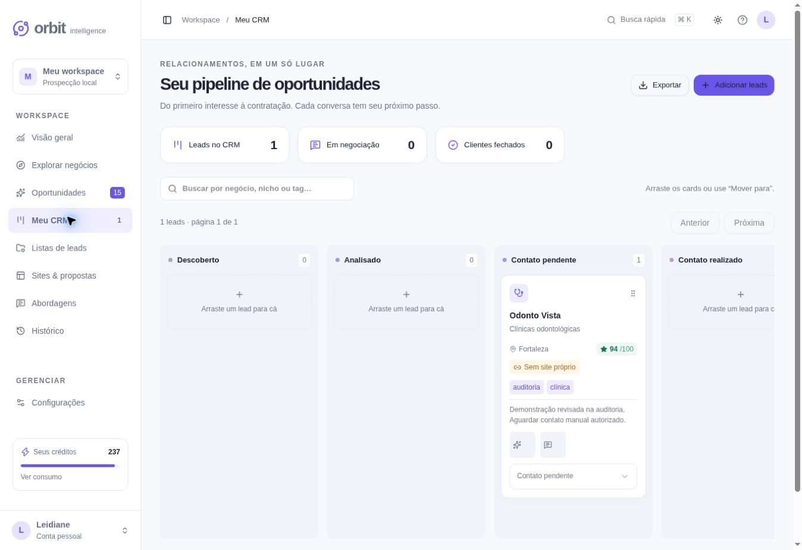

# Auditoria final pré-produção — Orbit

Data: 6 de outubro de 2026. Baseline: `6251dbf49910735aa91e0965c80dac4a16614e16`. Stack, identidade visual e hospedagem preservadas. **Nenhum deploy, mudança de audiência ou migration remota foi executado.**

**Resultado: NOT READY FOR PRODUCTION.** As correções de código passaram; os três gates operacionais restantes estão ao fim deste relatório. Testes com fixtures/contratos simulados são identificados e não aprovam uma integração real.

## Matriz corrigida

| ID  | Prioridade | Achado e correção                                                                                                     | Reteste                                                                                     |
| --- | ---------- | --------------------------------------------------------------------------------------------------------------------- | ------------------------------------------------------------------------------------------- |
| A01 | P0         | Owner comum podia administrar/conceder créditos; role e allowlist obrigatórias, padrão negar                          | Dois usuários, allowlist vazia/configurada; admin SSR 404/API 403                           |
| A02 | P1         | Dependências vulneráveis de runtime; patches compatíveis e overrides restritos, sem troca major                       | Audit de produção zero, lint/typecheck/build/Worker PASS                                    |
| A03 | P1         | Fixtures e Mock disponíveis em produção; ambiente explícito, bloqueio de geração e invisibilidade de fixtures antigas | Worker production vazio, mock indisponível, sem reseed após remoção                         |
| A04 | P1         | Operações persistentes/caras duplicáveis; chave durável, fingerprint, replay e bloqueio de commit incerto             | Concorrência, conflito e geração com uma cobrança                                           |
| A05 | P1         | Atualizar estágio podia sobrescrever notas/tags omitidas; update parcial e batch atômico                              | Mutação concorrente e persistência após refresh                                             |
| A06 | P1         | CRM perdia alcance além de 500 negócios; paginação/busca próprias no servidor                                         | Lead com score baixo além de 500 continua acessível                                         |
| A07 | P1         | Job concluído podia ser reclamado; estado, lease e janela obrigatórios                                                | Processadores concorrentes e tentativas contabilizadas                                      |
| A08 | P1         | Localização ambígua e parsing ilimitado; confirmar país/UF/cidade/CEP, Zod, bounds e bytes                            | CE/Fortaleza, SP/São Paulo, homônimos, CEP/coords inválidos, upstream parcial/erro          |
| A09 | P2         | Export sem limite real/rate limit e consultas por registro; bytes, limite e lookup em batches                         | Unicode, fórmulas, direitos por fonte e isolamento                                          |
| A10 | P2         | Client sem timeout, erro técnico e randomUUID indisponível em preview HTTP; cancelamento/erro legível/fallback seguro | Double-submit, HTML em API e HTTP local                                                     |
| A11 | P2         | Mapa não acompanhava resize; ResizeObserver/invalidateSize com cleanup                                                | Viewports, zoom, cluster, pin e sincronização com lead                                      |
| A12 | P2         | Health, headers e logs correlacionados ausentes; endpoint D1, CSP e request IDs                                       | Worker e 53 checks HTTP com assets/rotas reais                                              |
| A13 | P2         | Auditoria aceitava proxy sem atestar segurança; contrato DNS/redirect/robots obrigatório, final URL pública           | Resposta sem atestação recusada, IP privado rejeitado, estorno                              |
| A14 | P2         | Falha de IA bloqueava motor local; fallback explícito em geração e limites globais                                    | Upstream 503/JSON inválido, artefato local sem fatos inventados                             |
| A15 | P2         | Gates, migração/restore e runbook ausentes; predeploy, CI e procedimentos operacionais                                | Gates locais PASS, banco novo/upgrade/restore isolado PASS; recuperação gerenciada pendente |
| A16 | P1         | Âncoras do iframe abriam dashboard; base about:srcdoc apenas no editor                                                | Clique em Serviços preserva site; navegação publicada continua própria                      |
| A17 | P2         | Ver consumo não alterava aba já montada; aba validada derivada da URL                                                 | Workspace → Créditos, refresh e deep link                                                   |
| A18 | P2         | Configurações sugeriam mock/créditos de teste em produção; capacidades/copy conforme ambiente                         | Mock oculto quando desativado, concessões exigem admin                                      |
| A19 | P2         | Botões sem nome acessível no mobile; aria-label e rótulos PT-BR persistentes                                          | Teclado no CRM, pins nomeados e botão Fechar                                                |
| A20 | P1         | Lead/listas/actions extrapolavam mobile; grids minmax, quebra de texto e scroll interno                               | 12 telas × 11 larguras × 2 temas sem overflow do documento                                  |
| A21 | P1         | redirect:error incompatível com workerd instalado; manual e rejeição explícita de 3xx                                 | Contrato de redirect não encaminha Bearer, upstream 429/erro gera resposta segura           |
| A22 | P2         | Listas também dependiam do bootstrap; paginação/filtro por lista/busca no servidor e retry                            | Lista além de 500, usuário B sem acesso; criação/associação/refresh no navegador            |
| A23 | P1         | Overpass out tags omitia geometria dos nodes; consulta out center com corpo/coords                                    | Contrato verifica query e node com coordenadas preservadas                                  |

Contagem: **P0 encontrados/corrigidos 1/1; P1 11/11; P2 corrigidos 11.** A matriz descreve defeitos de código. Gates de destino não verificados não foram convertidos em “bugs corrigidos”.

## Validação executada

| Gate                              | Resultado               | Evidência/limite                                                                                       |
| --------------------------------- | ----------------------- | ------------------------------------------------------------------------------------------------------ |
| Instalação                        | PASS                    | Installer/frozen lockfile, Node 24.19.0, pnpm 11.25.0                                                  |
| Typecheck                         | PASS                    | TypeScript strict, sem supressões novas                                                                |
| Lint                              | PASS                    | Nenhum erro; validações mantidas                                                                       |
| Unitários                         | PASS                    | 34 testes de domínio/validação/client/segurança                                                        |
| Banco                             | PASS                    | 3 testes: fresh, upgrade e restore isolado; 29 tabelas/FKs/índice                                      |
| Integração                        | PASS                    | 122 verificações no Worker compilado + D1 isolado; persistência real, upstreams simulados declarados   |
| Build                             | PASS                    | Build Worker de produção, exit 0                                                                       |
| Start equivalente                 | PASS                    | Wrangler local com build compilada; 53 checks HTTP, health/SSR/refresh/auth/admin/assets               |
| E2E local no navegador            | PASS                    | Busca com fixtures marcadas → lead → site/versão → abordagem → CRM/notas/estágio/lista → refresh       |
| E2E com gateway e fonte reais     | **FAIL / não aprovado** | OAuth de destino sem roundtrip; live provider não concluiu descoberta                                  |
| Audit de dependências de produção | PASS                    | Nenhuma vulnerabilidade conhecida reportada                                                            |
| Audit completo                    | Risco registrado        | 2 advisories em ferramentas de build: esbuild 0.18.20 e braces 3.0.3; sem entrada de usuário no Worker |

`pnpm predeploy` concluiu todas as etapas com exit 0. Logs completos não equivalem a medição Lighthouse nem a validação de vendor. A CI foi configurada, mas sua execução remota ainda não ocorreu.

Build avisa sobre classificação estática de rotas no Vinext e três imagens CSS padrão do Leaflet que o mapa com divIcons não usa. Assets efetivamente referenciados pelo SSR responderam 200; não houve erro da aplicação na última leitura de console. Não foram removidas políticas ou escondidos warnings para aprovar o build.

## QA funcional e visual

Navegação exercitada: descoberta, dashboard, oportunidades, CRM, listas, sites/propostas, abordagens, histórico, configurações, créditos e onboarding. APIs de proposta/publicação/exportação foram validadas no Worker isolado; nenhuma mensagem comercial ou demonstração foi publicada no Site ativo. Páginas privadas redirecionam sem sessão; erros HTTP/admin foram exercitados na build. Login do gateway permanece um gate separado.

Pesquisa local: Brasil/CE/Fortaleza/CEP/odontologia/10km, filtro sem site próprio e score. Mapa carregou tiles, clusters, zoom e seleção do lead correto. Análise preservou incerteza e confidence. Site gerado foi editado, versão 2 salva, refresh preservou conteúdo; preview desktop/tablet/mobile e âncora Serviços funcionaram. Abordagem WhatsApp usou o negócio correto, permaneceu revisável e não incluiu link de rascunho. CRM preservou notas, tags, estágio alterado por teclado e associação de lista.

Pesquisa, dashboard, oportunidades, CRM, listas, sites, scripts, histórico, configurações, onboarding, lead e editor: **264 combinações** de tela/largura/tema verificadas no DOM real em iframes de viewport (320, 360, 375, 390, 412, 430, 768, 1024, 1280, 1440, 1920). Nenhum overflow horizontal do documento após correções; pipeline/tabelas usam scroll interno. Claro/Escuro persistiram e Sistema acompanhou o ambiente. Lista atualizada foi retestada a 320px. Harness temporário foi removido e sua presença bloqueia predeploy.

Teclado exercitou seletor de estágio, foco em formulários e modal; rótulos não dependem só de cor. Não houve auditoria certificada com leitor de tela, teste em hardware móvel/touch real ou Lighthouse/CrUX. Não alegar conformidade integral ou CWV medidos. Chunks são separados por rota; maior chunk medido é dashboard 352,4 KiB bruto/102,4 KiB gzip e Leaflet lazy 145,3/41,8 KiB, sem promessa de LCP/INP.

## Segurança e produção

| Item                      | Estado                           | Alcance                                                                                                                             |
| ------------------------- | -------------------------------- | ----------------------------------------------------------------------------------------------------------------------------------- |
| Secrets expostas          | NÃO encontradas                  | Fonte e todo histórico disponível examinados; nenhuma chave no client                                                               |
| Rotas privadas protegidas | SIM                              | APIs e SSR testados; depende de manter gateway SIWC privado confiável                                                               |
| Admin protegido           | SIM                              | Role + allowlist, default deny; acesso direto recusado                                                                              |
| Rate limit/créditos       | OK                               | Limites por organização/globais, atomicidade, estorno, idempotência e cache                                                         |
| SSRF protection           | OK no código                     | Sem fetch direto do alvo; URL preliminar e contrato estrito com proxy confiável; DNS real do proxy não configurado/validado         |
| Headers/XSS/export        | OK                               | CSP sem eval em produção, sandbox/HTML escapado, noindex, fórmulas neutralizadas                                                    |
| Env                       | OK documentado; destino pendente | .env.example completo, check:env PASS com configuração mínima; Site tem APP_ORIGIN, deve explicitar APP_ENV=production na liberação |
| Database migrations       | OK                               | Fresh/upgrade local; banco ativo não alterado                                                                                       |
| Domínio                   | OK, preservado                   | URL HTTPS gerenciada existente; domínio próprio não solicitado                                                                      |
| Observabilidade           | OK mínima                        | Health D1, request IDs, logs estruturados, AuditLog/ProviderUsage/jobs; alertas operacionais a configurar                           |
| Rollback                  | Procedimento documentado         | Retorno a artefato auditado compatível; troca de deployment não executada                                                           |
| Restore de produção       | PENDENTE                         | Restore local aprovado; mecanismo/permissão do D1 gerenciado ainda não comprovados                                                  |

Dados de teste não foram inseridos no banco ativo. Nenhuma credencial foi rotacionada porque nenhum segredo real foi encontrado no repositório. Integrações opcionais sem credenciais permanecem desativadas ou usam fallback explicitamente identificado; ausência dessas chaves não é classificada como bug.

## Somente bloqueadores restantes

1. **Autenticação no destino:** validar login SIWC, refresh, logout e recusa de conta não autorizada. Metadados e headers locais não aprovam OAuth real.
2. **Descoberta real no destino:** concluir o fluxo com uma fonte permitida e disponível. Workerd local falhou DNS; transporte Node recebeu ViaCEP/Nominatim 200 e Overpass 406. Nenhum estabelecimento real foi apresentado como resultado bem-sucedido. Confirmar egress/configuração/contato do operador antes do smoke.
3. **Recuperação do D1 gerenciado:** confirmar mecanismo e permissão de backup/checkpoint/restore, ensaiar recuperação em cópia autorizada e registrar instruções. Restore SQLite local não satisfaz esse gate.

Essas validações exigem acesso/configuração operacional ou ambiente de destino, não nova implementação inicial. O [runbook](production.md) descreve a sequência de liberação e rollback. **Não publicar enquanto permanecerem abertas.**
